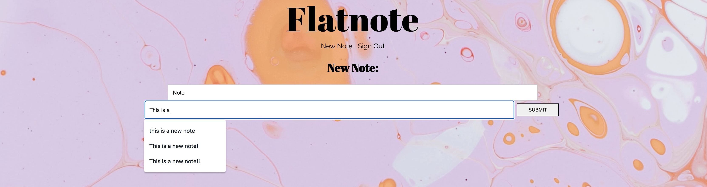

# README

[DEMO](https://www.youtube.com/watch?v=gCCV0sJjzZk)

## Flatnote
- A Javascript web app that allows the User to take notes and edit them.

## Application Features
- User can log in with a username and password
- User can keep a collection of notes
- Full CRUD capabilities
    -User can view, edit, and delete their notes

## Built With
- Javascript, React JS
- React Router for component routing 
- JSON server for data and note storage 
- CSS for styling

## Install Instructions
- Clone this repo to your local machine git clone
- Ensure your Backend is running at http://localhost:3001/
- run `json-server --watch db.json` on additional terminal
- run `npm install` 
- run `npm start`
